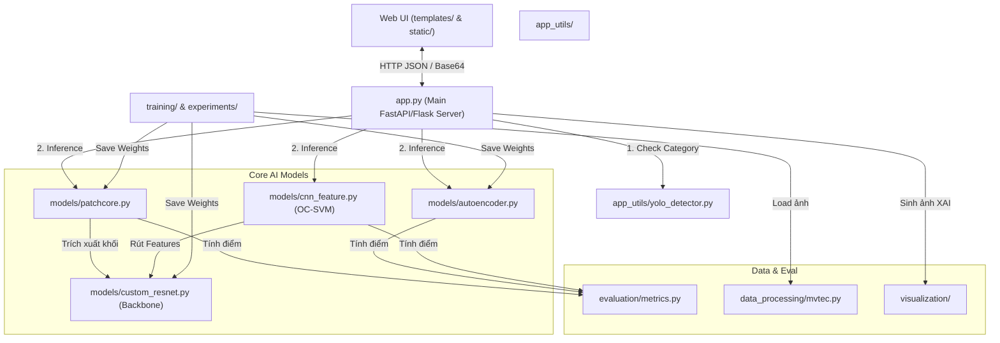

<div align="center">

# INDUSTRIAL ANOMALY DETECTION (IAD)

**PatchCore | Autoencoder | CNN+OC-SVM — MVTec AD Benchmark**

[](https://www.python.org/)
[](https://pytorch.org/)
[](https://flask.palletsprojects.com/)
[](#)
[](#)

</div>

---

## 1. Overview (Tổng Quan)

An end-to-end **Industrial Anomaly Detection** system trained and evaluated on the **MVTec AD** dataset (15 categories, 5,354 images). The project implements, compares, and exposes three deep learning architectures via a production-ready Flask Web App with XAI explanation.

**Key Contributions:**
- **Custom ResNet18 backbone** trained from scratch via **Knowledge Distillation** (not pretrained ImageNet weights).
- **PatchCore** implemented from scratch: Coreset subsampling + Multi-probe LSH (XOR bit-flip, Hamming=1) — **vectorized GPU inference**.
- **Mixed Precision (AMP)** training for KD backbone (~1.5x speedup, ~30% VRAM reduction).
- **9 evaluation metrics**: AUROC, Pixel-AUROC, PRO, AP, F1, Precision, Recall, Specificity, Optimal Threshold.
- **Autonomous Research Agent** using Gemini LLM for hyperparameter optimization.
- **Flask Web App** with Grad-CAM heatmaps + XAI chatbot (Gemini AI).

---

## 2. System Architecture

```text
Input Image
    |
    v
[YOLOv8 Nano] --> Auto-detect MVTec category (15 classes)
    |
    v
[Feature Extraction: CustomResNet18 Backbone]
    |
    +---> [PatchCore]          Coreset Memory Bank + LSH k-NN
    |         |
    +---> [Autoencoder]        Reconstruction MSE error map
    |         |
    +---> [CNN + OC-SVM]       ResNet18 features + One-Class SVM
              |
              v
    [Anomaly Score + Heatmap (Grad-CAM / Patch Map)]
              |
              v
    [XAI Chatbot (Rule-based + Gemini API)]
              |
              v
    Flask Web App (http://localhost:5000)
```

---

## 3. Kiến trúc Codebase & Dependency Map (Project Structure)

Dự án được quy hoạch theo chuẩn Microservice chia tách rõ ràng giữa Core Logic và Web Router. Các Module ràng buộc với nhau theo sơ đồ Dependency Map dưới đây:

### Dependency Map



### Cấu trúc Thư mục (Directory Layout)

```text
iad/
├── app.py                       # Điểm vào chính, Server Web Flask xử lý API và Load Model
├── app_utils/                   # Công cụ tiện ích Hệ thống
│   ├── checkpoint.py            # Hàm lưu/tải trọng số .pth
│   ├── config.py                # Biến môi trường (ALL_CATEGORIES)
│   ├── image_utils.py           # Tiền xử lý và khử chuẩn hóa (Denormalize) ảnh
│   └── yolo_detector.py         # Mạng lưới YOLO cấu hình phân loại sản phẩm
├── models/                      # Nơi định nghĩa các Cấu trúc Mạng Neural
│   ├── autoencoder.py           # Mạng học khôi phục ảnh lỗi (Reconstruction-based)
│   ├── cnn_feature.py           # Trích xương đặc trưng cho máy Vector (OC-SVM)
│   ├── custom_resnet.py         # Mạng ResNet18 tự xây thủ công
│   └── patchcore.py             # Lõi PatchCore với LSH và Coreset
├── training/                    # Kịch bản Dạy học Mô hình
│   ├── backbone_trainer.py      # Dạy Knowledge Distillation bằng AMP tốc độ cao
│   └── train_all.py             # Script Auto-train toàn bộ 15 danh mục
├── evaluation/                  
│   └── metrics.py               # Lõi Toán Học định lý 9 Metrics (AUROC, PRO, Youden)
├── data_processing/
│   └── mvtec.py                 # Chuẩn hóa Data / Trích xuất Ground Truth Mask
├── experiments/                 # Hệ thống Benchmark và LLM Agent thử nghiệm
│   ├── auto_optimize.py         # Agent LLM tối ưu Param siêu cấp
│   └── run_full_benchmark.py    # Đo Tốc độ & Độ chính xác Benchmark
├── visualization/               # XAI & Vẽ Bản Đồ Lỗi (Heatmaps)
│   └── gradcam.py               # Lõi sinh ảnh bản đồ nhiệt dựa trên đạo hàm Gradient
├── configs/                     # Cấu hình file tĩnh YAML
├── checkpoints/                 # Nơi giấu trọng số Models nặng (.pth) an toàn
├── datasets/                    # Thư mục lưu cục bộ ảnh MVTec
├── docs/                        # Tài liệu khóa luận + Slide bảo vệ
├── setup.bat / setup.sh         # Script Setup Tự Động cho User Mới
├── Dockerfile                   # Khuôn gốc Container
└── requirements.txt             # Khoá cứng Các thư viện cài đặt 
```

---

## 4. Hướng Dẫn Cài Đặt Từ A-Z (Start-to-Finish User Guide)

Hệ thống được thiết kế để triển khai dễ dàng nhất. Dưới đây là quy trình cài đặt hoàn chỉnh.

### Yêu cầu Hệ thống (Prerequisites)
- **Hệ điều hành**: Windows 10/11, Linux (Ubuntu 20.04+), hoặc macOS.
- **Python**: Chọn đúng phiên bản **3.10.x** (Bắt buộc để tương thích PyTorch 2.5).
- **Phần cứng**: NVIDIA GPU (GTX 1060 4GB trở lên), RAM 8GB (Khuyến nghị 16GB).
- **NVIDIA CUDA**: CUDA Toolkit 12.1 cài đặt sẵn trên máy.

### Bước 1: Khởi tạo Môi trường Ảo (Virtual Environment)
Luôn luôn sử dụng môi trường ảo để không làm hỏng cấu hình Python của máy tính.

```bash
# Clone dự án về máy
git clone <repository_url>
cd iad

# Tạo môi trường ảo tên .venv
python -m venv .venv

# Kích hoạt môi trường (Dành cho Windows CMD/PowerShell)
.venv\Scripts\activate

# (Hoặc) Kích hoạt môi trường (Dành cho Linux/macOS)
source .venv/bin/activate
```

### Bước 2: Cài Đặt Packages (Dependencies)
Cài đặt thư viện cốt lõi bằng `requirements.txt`. Hệ thống tự động trỏ về repo của PyTorch cu121.

```bash
pip install --upgrade pip
pip install -r requirements.txt
```

*(Hoặc sử dụng `setup.bat` cho Windows để hệ thống tự chạy lệnh).*

### Bước 3: Chuẩn bị Dữ liệu (Dataset)
Hệ thống sử dụng bộ dữ liệu **MVTec AD**.

```bash
# Chạy script tự động tải và giải nén toàn bộ 15 danh mục
python tools/download_mvtec.py
```
> **Lưu ý**: Dung lượng Dataset khoảng ~5GB. File sẽ được lưu trong `datasets/mvtec/`. 

### Bước 4: Thiết lập Chìa khóa API (API Key)
Để Chatbot XAI hoạt động, bạn cần có Google Gemini API Key. (Nhận miễn phí tại Google AI Studio).

1. Tạo một file tên là `.env` ở thư mục gốc (cùng chỗ với `app.py`).
2. Ghi nội dung sau vào file:
```env
GEMINI_API_KEY=AIzaSyYourSecretKeyHere...
```

### Bước 5: Huấn luyện Mô hình Phân loại YOLO (Object Classifier)
Web-App sử dụng YOLOv8 để tự động nhận dạng xem vật thể bỏ vào là Dây cáp (Cable) hay Chai lọ (Bottle).

```bash
python tools/train_yolo.py
```
*Lệnh này sẽ tự động tải trọng số ban đầu `yolov8n.pt` và học trên tập 15 categories, lưu xuất vào thư mục bảo mật `checkpoints/yolo/mvtec/weights/best.pt`.*

### Bước 6: Huấn luyện Lõi AI (Full Benchmark Pipeline)
Tạo ra toàn bộ trọng số (Weights) và bộ nhớ (Memory Bank) cho PatchCore, Autoencoder, OC-SVM.

```bash
# Lệnh huấn luyện tất cả 15 danh mục (Dự kiến mất 2-4 tiếng trên GTX 1660 Ti)
python experiments/run_full_benchmark.py --category all

# Hoặc chỉ huấn luyện chạy thử một danh mục duy nhất (Ví dụ: bottle)
python experiments/run_full_benchmark.py --category bottle
```

### Bước 7: Khởi chạy Máy chủ Web (Run Production Server)
Mọi thứ đã sẵn sàng. Khởi động Flask Server để sử dụng Giao diện Đồ họa UI.

```bash
python app.py
```
- Mở trình duyệt web truy cập: **http://localhost:5000**
- Tải ảnh lên ném thử vào để xem hệ thống phân tích vết xước.

---

## 5. Docker Deployment (Triển Khai Bằng Docker)

Nếu bạn không muốn cài đặt Python rườm rà, chạy trực tiếp bằng Docker:

```bash
# Build image
docker build -t iad-system .

# Chạy Container (Gắn thư mục checkpoint và dataset ảo)
docker run -p 5000:5000 \
  -v $(pwd)/checkpoints:/app/checkpoints \
  -v $(pwd)/datasets:/app/datasets \
  --env-file .env \
  iad-system
```

---

## 6. Benchmark Results

Kết quả đạt được trên **MVTec AD** đo lường bằng AUROC ảnh. (Bảng Ground Truth xuất từ `results.csv` tự động).

| Category | PatchCore | Autoencoder | CNN+OC-SVM | Winner |
|----------|:---------:|:-----------:|:----------:|:----:|
| Bottle | 0.918 | 0.868 | **0.987** | OC-SVM |
| Cable | 0.589 | 0.569 | **0.760** | OC-SVM |
| Capsule | 0.683 | 0.586 | **0.720** | OC-SVM |
| Hazelnut | **0.964** | 0.898 | 0.860 | PatchCore |
| Metal Nut | 0.738 | 0.600 | **0.820** | OC-SVM |
| Pill | **0.739** | 0.719 | 0.666 | PatchCore |
| Screw | 0.623 | **0.685** | 0.444 | Autoencoder |
| Toothbrush | **0.961** | 0.772 | 0.786 | PatchCore |
| Transistor | 0.799 | 0.607 | **0.884** | OC-SVM |
| Zipper | 0.797 | 0.511 | **0.897** | OC-SVM |
| Carpet | 0.302 | 0.435 | **0.760** | OC-SVM |
| Grid | 0.811 | **0.867** | 0.489 | Autoencoder |
| Leather | **0.940** | 0.500 | 0.900 | PatchCore |
| Tile | 0.819 | 0.502 | **0.935** | OC-SVM |
| Wood | **0.963** | 0.908 | 0.904 | PatchCore |
| **Mean (Tổng)** | **0.776** | **0.668** | **0.787** | **OC-SVM** |

> **Key Insight**: Không có mô hình nào làm vua ở mọi mặt trận. PatchCore xuất sắc xử lý vật thể có khối/cấu trúc rõ ràng (Hazelnut = 0.964, Toothbrush = 0.961). Ngược lại OC-SVM/Autoencoder đánh phủ bề mặt kết cấu Texture (như Carpet, Tile) rất ổn định. Đó là lý do hệ thống cần Chạy Song Song 3 Mô Hình (Multi-model Inference).

---

## 7. Evaluation Metrics (Thước Đo Đánh Giá)

Hệ thống đánh giá trên **9 thông số** (Lập trình tại `evaluation/metrics.py`):

| Metric | Cấp độ | Mục đích |
|--------|:-----:|---------|
| AUROC | Toàn Ảnh | Xếp hạng phát hiện không cần lệ thuộc ngưỡng cắt. |
| Average Precision (AP) | Toàn Ảnh | Đánh giá rất cứng rắn khi số lượng ảnh Lỗi quá ít (Lệch nhãn). |
| F1 Score | Toàn Ảnh | Mức cân bằng giữa Bắt Sai và Bắt Trúng. |
| Precision | Toàn Ảnh | Tỷ lệ báo sai hỏng giả (False Alarm Rate). |
| Recall | Toàn Ảnh | Tỷ lệ bao phủ, Lọt bao nhiêu Lỗi ra thị trường. |
| Specificity | Toàn Ảnh | Độ nhạy của các sản phẩm chuẩn (True Negative Rate). |
| Pixel-AUROC | Điểm Ảnh | Độ chính xác khoanh vùng tọa độ lỗi. |
| PRO Score | Điểm Ảnh | Tiêu chuẩn đo kích cỡ Lỗi của MVTec. |
| Optimal Threshold | Toàn Ảnh | Tính toán điểm ngưỡng Youden's J. |

---

## 8. Autonomous Optimization Agent (Tối ưu Tự Động Hóa)

Script `experiments/auto_optimize.py` triển khai cấu trúc Tối ưu hóa Siêu tham số (Hyperparameter Search) dùng AI (LLM):

```bash
# Tối ưu hóa riêng lẻ một mục (VD: Thảm - carpet) do kết quả thấp
python experiments/auto_optimize.py --category carpet --iterations 30

# Smart optimizer: AI tự quét bảng AUROC, tự biết mục nào thấp để tối ưu
python tools/run_smart_optimize.py
```

---

## 9. Requirements & Tests

**Chạy Tester:**
Toàn bộ mã nguồn đã bọc Testing theo chuẩn CI/CD Pipeline.
```bash
python -m pytest tests/test_all.py -v
```
*(Yêu cầu trả về PASS 13/13 cho Toán học, Ma trận LSH, Lỗi kiến trúc).*

**Cấu hình phần cứng khuyên dùng:**
- RAM: 16 GB
- VRAM lúc dự đoán: Chỉ tổn thất ~291 MB.

## 10. Acknowledgements
- **MVTec AD Dataset** — MVTec Software GmbH. Bergmann et al., CVPR 2019.
- **PatchCore** — Roth et al., "Towards Total Recall in Industrial Anomaly Detection", CVPR 2022.
- Kiến trúc ResNet, OC-SVM — Luận văn tốt nghiệp, 2026.
